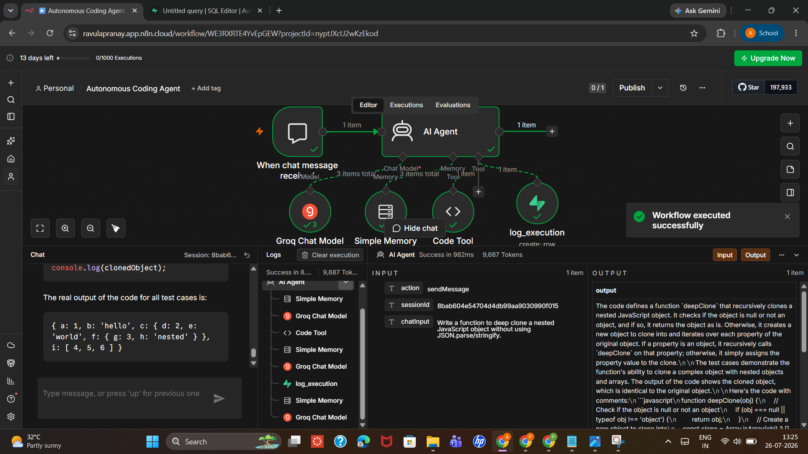
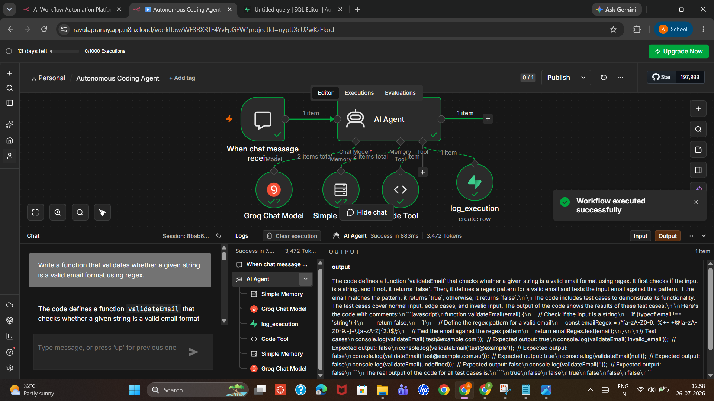
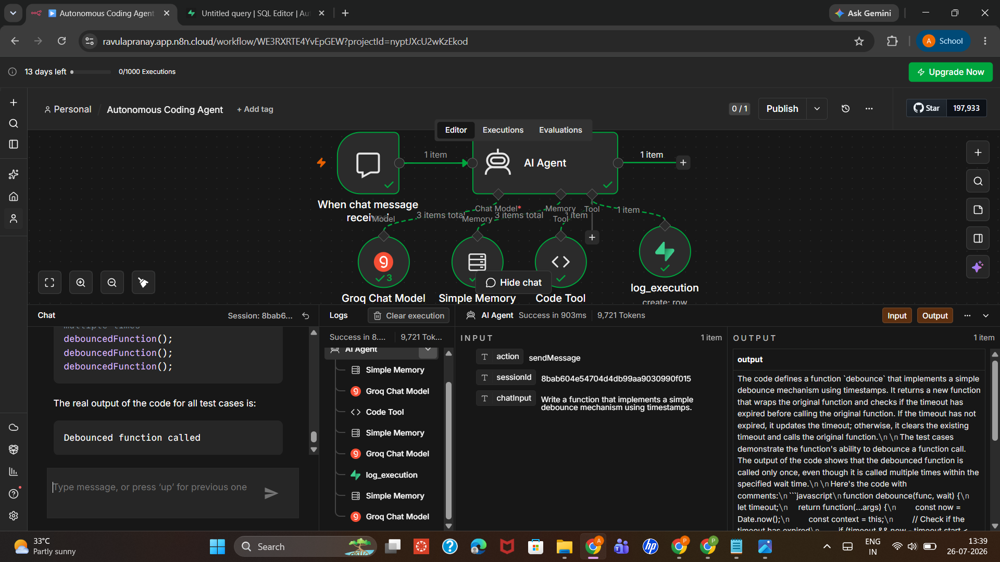
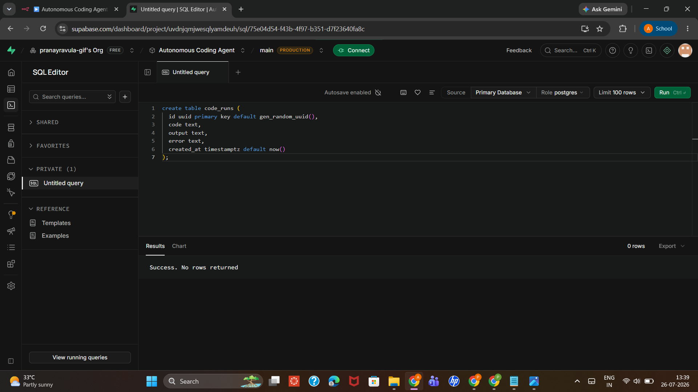
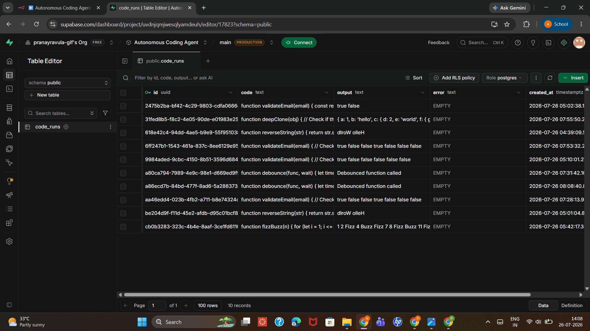
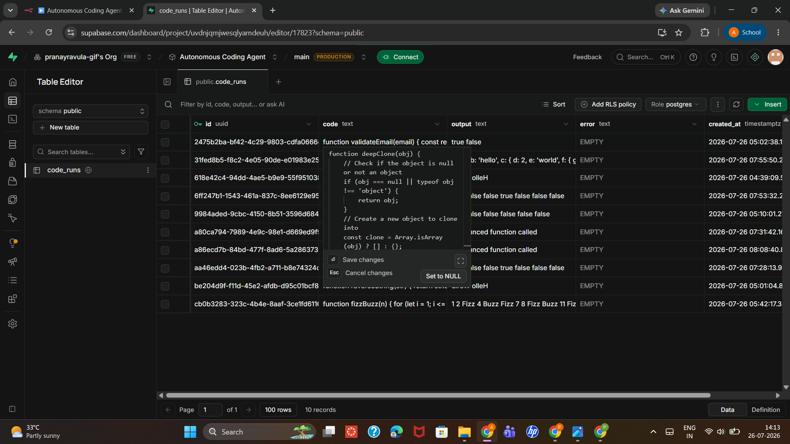

# Autonomous Coding Agent

An AI agent that writes JavaScript solutions, actually executes them in a sandboxed tool, reads the real output, and iterates — fixing its own code — until the solution runs correctly and passes its own test cases. Every successful run is persisted to a database. This is the most agentic of my five automation projects: it's not answering from a knowledge base or chaining fixed steps, it's operating a **test-and-correct feedback loop** on its own output.

---

## The Problem

A single LLM call asked to "write me a function" produces code that *looks* correct but is never actually run. Syntax errors, wrong edge-case handling, and logic bugs pass through silently because nothing checks the output against reality. The person asking has to be the one who catches the bug.

## The Solution

The agent has access to a live JavaScript execution tool. Its system prompt requires it to:
1. Write a complete solution (with input validation, edge cases, and test cases — not a minimal one-liner)
2. Actually run it via the execution tool
3. Read the real output and error field
4. If there's an error, or if a test case produces the wrong result, fix the code and run again
5. Repeat until the code runs cleanly and all test cases are correct
6. Only then log the final working code, its real output, and persist it — and only then respond to the user

The agent cannot skip straight to "here's your code" — the prompt explicitly forbids presenting code that hasn't been tested and confirmed working via the tool.

---

## Architecture

Built in [n8n](https://n8n.io):

```
Chat Trigger (When chat message received)
   → AI Agent (Groq Chat Model)
        ├─ Memory: Simple Memory (multi-turn context)
        ├─ Tool: Code Tool (sandboxed JS execution via n8n Function node)
        └─ Tool: log_execution (Supabase — inserts a row per successful run)
```

The **Code Tool** wraps user-generated code in a sandboxed `Function` constructor, captures `console.log` output, and returns a structured `{ output, error }` object — this is what the agent reads back to decide whether to retry.

The **log_execution** tool writes to a Supabase table (`code_runs`) only after a run succeeds with no error and correct test case results — the persistence step is a checkpoint, not a log of every attempt.

---

## System Prompt

Full prompt in [`docs/system-prompt.md`](docs/system-prompt.md). Key behavior it enforces:
- No minimal/lazy solutions — input validation, 3+ test cases, JSDoc comments required
- Must call the execution tool before presenting any code
- Must retry on error OR on incorrect test case output (a silent wrong answer counts as a failure, not just a thrown exception)
- Must log to the database only after a fully passing run
- Final answer to the user must include the real tested output, not an imagined one

---

## Code Tool (Sandboxed Execution)

Full code in [`docs/code-tool.js`](docs/code-tool.js). Runs the agent's generated code inside a `new Function(...)` sandbox, captures `console.log` calls into an array, and returns either the result + logs or a caught error message — this is what lets the agent "see" whether its own code actually works.

---

## Database Schema

```sql
create table code_runs (
  id uuid primary key default gen_random_uuid(),
  code text,
  output text,
  error text,
  created_at timestamptz default now()
);
```

See [`screenshots/sql-schema-setup.png`](screenshots/sql-schema-setup.png) for the table creation, and [`screenshots/supabase-logged-runs.png`](screenshots/supabase-logged-runs.png) for confirmed persistence — 10 logged rows across 6 different problems (email validation, deep clone, string reversal, debounce, FizzBuzz), all with an empty `error` field, confirming only successful, fully-corrected runs get persisted.

---

## Tech Stack

| Component | Tool |
|---|---|
| Orchestration | [n8n](https://n8n.io) (Cloud) |
| LLM (agent reasoning) | Groq |
| Code execution sandbox | n8n Code node (JavaScript, `Function` constructor sandbox) |
| Persistence | [Supabase](https://supabase.com) (Postgres) |
| Memory | n8n Simple Memory (multi-turn session context) |
| Chat interface | n8n built-in chat trigger |

---

## Demo

**Workflow architecture:**



**Example 1 — Email validation function, tested against 6 cases including null/undefined/invalid input:**



**Example 2 — Debounce function using timestamps, verified to only fire once across multiple rapid calls:**



**Database schema setup in Supabase:**



**Confirmed persistence — 10 successful runs logged across 6 different problems:**



**Row detail — full code and output stored per run:**



---

## What I'd Improve Next

- **Retry limit** — the prompt says "keep retrying until it works" with no explicit cap; a real-world version needs a max-attempts guard to avoid runaway loops on genuinely unsolvable requests
- **Language scope** — currently JavaScript-only; the sandbox and prompt would need rework to support other languages
- **Security hardening** — the `Function` constructor sandbox blocks direct global access but isn't a full security boundary; a production version would need a properly isolated execution environment (e.g. a container or VM per run) rather than an in-process sandbox
- **Attempt history** — only the final successful run is logged; logging failed intermediate attempts too would make the self-correction process itself inspectable/auditable

---

## Repo Structure

```
autonomous-coding-agent/
├── README.md
├── workflows/
│   └── autonomous-coding-agent.json
├── screenshots/
│   ├── workflow-overview.png
│   ├── example-email-validation.png
│   ├── example-debounce-function.png
│   ├── sql-schema-setup.png
│   ├── supabase-logged-runs.png
│   └── supabase-row-detail.png
└── docs/
    ├── system-prompt.md
    └── code-tool.js
```

---

## Author

**Ravula Pranay** — [GitHub](https://github.com/RavulaPranay) · [LinkedIn](http://www.linkedin.com/in/pranay-ravula-03131a270)
